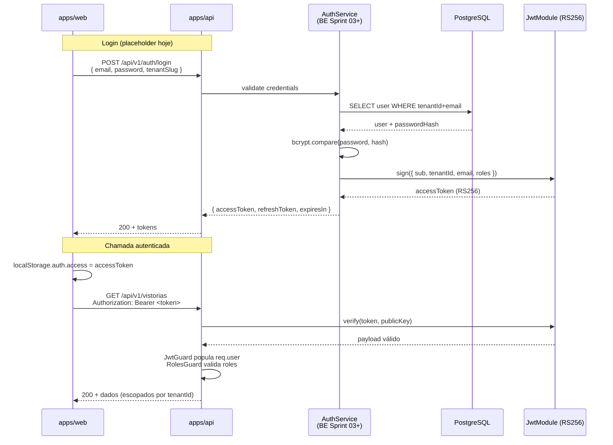
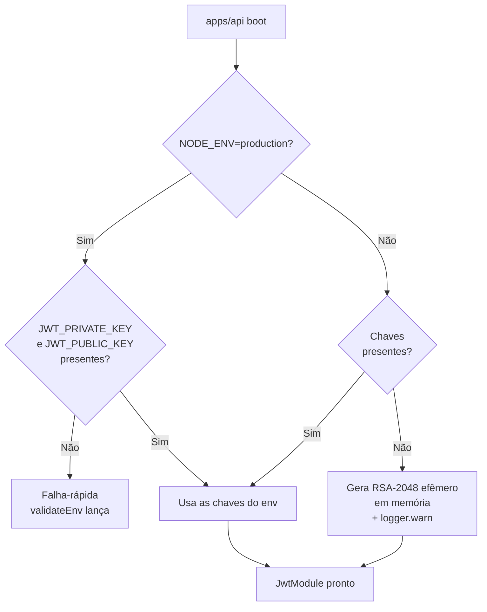

# Fluxo de Autenticação — JWT RS256

Decisão e setup em [ADR-004](../decisions/ADR-004-jwt-rs256.md).

## Sequência: login + chamada autenticada



## Setup das chaves



## Estrutura do payload

```typescript
interface JwtPayload {
  sub: string; // user id (UUID)
  tenantId: string; // tenant id (UUID)
  email: string;
  roles: Role[]; // ADMIN | GESTOR | VISTORIADOR | CLIENTE | PARCEIRO
  iat?: number;
  exp?: number;
  iss: string; // 'vistoria-platform'
  aud: string; // 'vistoria-api'
}
```

`iss` e `aud` são validados na verificação para evitar reuso de tokens entre sistemas.

## Guards

- `JwtGuard` (registrado como `APP_GUARD` global) — exige Bearer token, popula `req.user`. Respeita `@Public()` para opt-out.
- `RolesGuard` (idem global) — checa `@Roles(...)` na rota; se vazio, libera.
- `@CurrentUser()` decorator extrai o `AuthenticatedUser` do request.

## Pendências

- **Refresh tokens em Redis** com TTL e revogação por logout — BE Sprint 03+
- **Rotação de chaves** com `kid` no header e suporte a múltiplas chaves de verificação simultâneas — produção
- **`localStorage` no FE** é placeholder; mover para httpOnly cookie quando o BE liberar (CSRF mitigado pela própria estratégia de cookie + SameSite=strict)
- **MFA**: roadmap, possivelmente WebAuthn/passkeys
