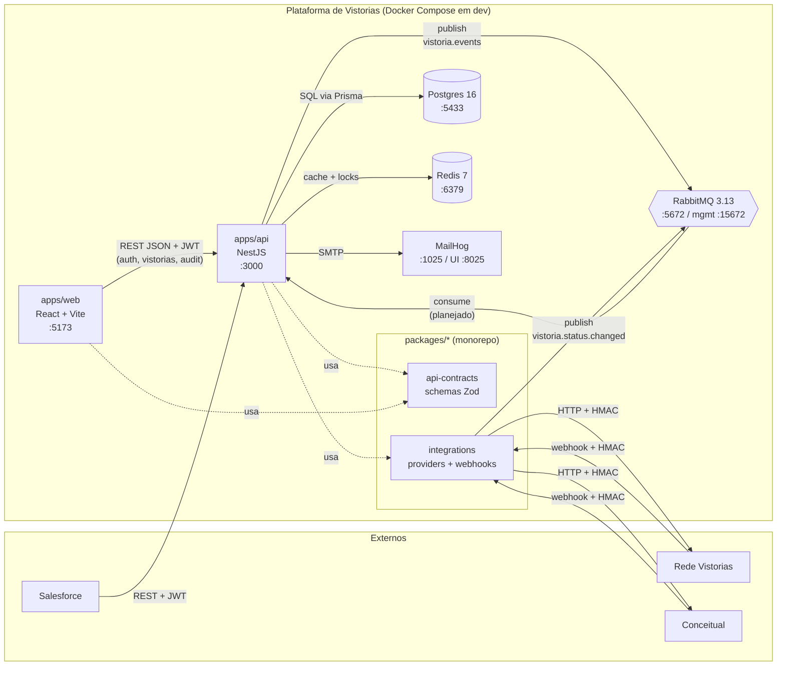

# C4 — Container

Containers internos da Plataforma de Vistorias e suas dependências de runtime. Refina o [c4-context.md](./c4-context.md).

## Diagrama

## Containers

| Container                | Tecnologia                      | Responsabilidade                                          | Porta dev    |
| ------------------------ | ------------------------------- | --------------------------------------------------------- | ------------ |
| `apps/api`               | NestJS 10 + TypeScript + Prisma | Domínio, SAGA, autenticação, audit, REST API              | 3000         |
| `apps/web`               | React 19 + Vite 5 + Tailwind    | Painel admin (gestores e administradores)                 | 5173         |
| `packages/api-contracts` | Zod + tsc (ESM)                 | Schemas e enums compartilhados FE↔BE                      | —            |
| `packages/integrations`  | NestJS module + Axios + amqplib | Adapters de parceiros, webhook controller, RMQ subscriber | —            |
| Postgres 16              | container `vistoria-postgres`   | Banco principal (tenants, users, audit_logs, domínio)     | 5433         |
| Redis 7                  | container `vistoria-redis`      | Cache, locks distribuídos, futuros rate-limits            | 6379         |
| RabbitMQ 3.13            | container `vistoria-rabbitmq`   | Exchange `vistoria.events` + filas dos consumers          | 5672 / 15672 |
| MailHog                  | container `vistoria-mailhog`    | SMTP fake para dev                                        | 1025 / 8025  |

## Decisões que justificam o desenho

- Mensageria: RabbitMQ ([ADR-001](../decisions/ADR-001-rabbitmq-vs-kafka.md))
- ORM: Prisma ([ADR-003](../decisions/ADR-003-prisma-vs-typeorm.md))
- Driver AMQP no Nest: amqplib direto ([ADR-006](../decisions/ADR-006-amqplib-vs-nestjs-microservices.md))
- HTTP client: axios ([ADR-008](../decisions/ADR-008-axios-vs-fetch.md))
- Webhook signing: HMAC SHA-256 ([ADR-007](../decisions/ADR-007-webhook-hmac-sha256.md))
- Auth: JWT RS256 ([ADR-004](../decisions/ADR-004-jwt-rs256.md))
- Build do monorepo: Turborepo ([ADR-002](../decisions/ADR-002-turborepo-vs-nx.md))

## Observações operacionais

- Postgres exposto na porta **5433** no host (não 5432) para não conflitar com instalações nativas no Windows. Dentro da rede `vistoria-net`, continua em 5432.
- `apps/api` lê `.env` para `DATABASE_URL`, `RABBITMQ_URL`, `REDIS_URL`; defaults batem com o `infra/.env.example`.
- `apps/web` em dev usa proxy do Vite (`/api`, `/health`) para o `apps/api`; em produção precisa de `VITE_API_BASE_URL` absoluto.

## Fluxos atuais entre containers

| Origem                          | Destino                                                      | Protocolo / topic  | Quando entrou                                                                       |
| ------------------------------- | ------------------------------------------------------------ | ------------------ | ----------------------------------------------------------------------------------- |
| `apps/web` → `apps/api`         | REST `auth/login` + `auth/me`                                | HTTPS + JWT RS256  | Sprint 07 (BE) + Sprint 09 (FE consumiu)                                            |
| `apps/web` → `apps/api`         | REST `vistorias` CRUD + `audit-logs`                         | HTTPS + JWT RS256  | Sprint 09 (FE consumiu)                                                             |
| `apps/api` → Postgres           | Prisma                                                       | TCP (5432 interno) | Sprint 02 (BE)                                                                      |
| `apps/api` → RabbitMQ           | publish `vistoria.events` (genérico)                         | AMQP               | Sprint 02 (BE)                                                                      |
| `integrations` → RabbitMQ       | publish `vistoria.status.changed` no `vistoria.events` topic | AMQP               | Sprint 08 (IN — ver [ADR-013](../decisions/ADR-013-vistoria-status-writer-port.md)) |
| RabbitMQ → `apps/api`           | consume `vistoria.status.changed` (handler)                  | AMQP               | **Planejado** (Sprint 11+ BE) — fecha o caminho webhook → SAGA                      |
| Parceiro RV/CC → `integrations` | webhook HTTPS + HMAC                                         | HTTPS              | Sprint 03 (IN) / reescrito no Sprint 08                                             |
| `integrations` → Parceiro RV/CC | REST + HMAC                                                  | HTTPS              | Sprint 03 (esqueleto); `agendar()` real ainda pendente do IN                        |

A seta `RabbitMQ → apps/api` está tracejada com label "(planejado)" no diagrama — a queue já recebe mensagens publicadas pelo IN no Sprint 08, mas o handler do BE só será registrado quando o Sprint 11 (BE) consumir.
