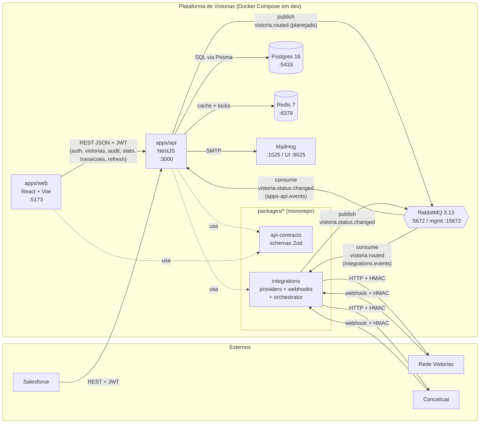
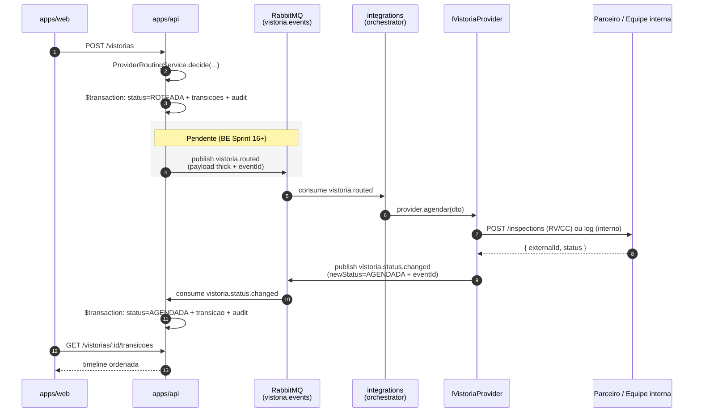

# C4 — Container

Containers internos da Plataforma de Vistorias e suas dependências de runtime. Refina o [c4-context.md](./c4-context.md).

## Diagrama

## Containers

| Container                | Tecnologia                      | Responsabilidade                                                                       | Porta dev    |
| ------------------------ | ------------------------------- | -------------------------------------------------------------------------------------- | ------------ |
| `apps/api`               | NestJS 10 + TypeScript + Prisma | Domínio, SAGA, autenticação, audit, REST API, consumer `vistoria.status.changed`       | 3000         |
| `apps/web`               | React 19 + Vite 5 + Tailwind    | Painel admin (gestores e administradores), refresh transparente                        | 5173         |
| `packages/api-contracts` | Zod + tsc (ESM)                 | Schemas e enums compartilhados FE↔BE (DTOs HTTP + event payloads BE↔IN)                | —            |
| `packages/integrations`  | NestJS module + Axios + amqplib | Adapters de parceiros, webhook controller, RMQ writer + `AgendamentoOrchestrator`      | —            |
| Postgres 16              | container `vistoria-postgres`   | Banco principal (tenants, users, audit_logs, domínio)                                  | 5433         |
| Redis 7                  | container `vistoria-redis`      | Cache, locks distribuídos, futuros rate-limits                                         | 6379         |
| RabbitMQ 3.13            | container `vistoria-rabbitmq`   | Exchange `vistoria.events` + filas `apps-api.events` (BE) e `integrations.events` (IN) | 5672 / 15672 |
| MailHog                  | container `vistoria-mailhog`    | SMTP fake para dev                                                                     | 1025 / 8025  |

## Decisões que justificam o desenho

- Mensageria: RabbitMQ ([ADR-001](../decisions/ADR-001-rabbitmq-vs-kafka.md))
- ORM: Prisma ([ADR-003](../decisions/ADR-003-prisma-vs-typeorm.md))
- Driver AMQP no Nest: amqplib direto ([ADR-006](../decisions/ADR-006-amqplib-vs-nestjs-microservices.md))
- HTTP client: axios ([ADR-008](../decisions/ADR-008-axios-vs-fetch.md))
- Webhook signing: HMAC SHA-256 ([ADR-007](../decisions/ADR-007-webhook-hmac-sha256.md))
- Auth: JWT RS256 ([ADR-004](../decisions/ADR-004-jwt-rs256.md))
- Refresh token: stateless ([ADR-014](../decisions/ADR-014-refresh-token-stateless.md))
- Identidade de evento: `eventId` UUID no writer ([ADR-015](../decisions/ADR-015-dedup-eventid-writer.md))
- IN escreve Vistoria.status via port + evento RMQ ([ADR-013](../decisions/ADR-013-vistoria-status-writer-port.md))
- Build do monorepo: Turborepo ([ADR-002](../decisions/ADR-002-turborepo-vs-nx.md))

## Observações operacionais

- Postgres exposto na porta **5433** no host (não 5432) para não conflitar com instalações nativas no Windows. Dentro da rede `vistoria-net`, continua em 5432.
- `apps/api` lê `.env` para `DATABASE_URL`, `RABBITMQ_URL`, `REDIS_URL`, `JWT_*` (incluindo `JWT_REFRESH_EXPIRES_IN` desde S12); defaults batem com o `infra/.env.example`.
- `apps/web` em dev usa proxy do Vite (`/api`, `/health`) para o `apps/api`; em produção precisa de `VITE_API_BASE_URL` absoluto.
- Sessão no FE persistida em `localStorage` (`auth.access` + `auth.refresh` + `auth.user`). Migração para cookie httpOnly é decisão pendente (ADR futuro).

## Fluxos atuais entre containers

| Origem                          | Destino                                                                     | Protocolo / topic  | Quando entrou                                                                                                 |
| ------------------------------- | --------------------------------------------------------------------------- | ------------------ | ------------------------------------------------------------------------------------------------------------- |
| `apps/web` → `apps/api`         | REST `auth/login` + `auth/me` + `auth/refresh`                              | HTTPS + JWT RS256  | S07 (BE) + S09 (FE) + S12 (BE refresh) + S14 (FE consumiu refresh)                                            |
| `apps/web` → `apps/api`         | REST `vistorias` CRUD + `audit-logs` + `vistorias/stats` + `:id/transicoes` | HTTPS + JWT RS256  | S09 (FE plugou CRUD/audit) + S12 (BE stats/transicoes) + S14 (FE plugou stats/timeline)                       |
| `apps/api` → Postgres           | Prisma                                                                      | TCP (5432 interno) | S02 (BE)                                                                                                      |
| `apps/api` → RabbitMQ           | publish `vistoria.events` (genérico, `RmqPublisher`)                        | AMQP               | S02 (BE)                                                                                                      |
| `apps/api` → RabbitMQ           | publish `vistoria.routed` (planejado para BE Sprint 16+)                    | AMQP               | **Planejado** — pedido em [agent-sync IN→BE](../agent-sync/2026-05-20-from-in-to-be-vistoria-routed-event.md) |
| `integrations` → RabbitMQ       | publish `vistoria.status.changed` (com `eventId`)                           | AMQP               | S08 (IN) + S13 (IN — `eventId`; ver [ADR-015](../decisions/ADR-015-dedup-eventid-writer.md))                  |
| RabbitMQ → `apps/api`           | consume `vistoria.status.changed` (fila `apps-api.events`)                  | AMQP               | S12 (BE — handler idempotente + audit `VISTORIA.STATUS_CHANGED`)                                              |
| RabbitMQ → `integrations`       | consume `vistoria.routed` (fila `integrations.events`, dormente)            | AMQP               | S13 (IN — `AgendamentoOrchestrator`); dispara `agendar()` no provider                                         |
| Parceiro RV/CC → `integrations` | webhook HTTPS + HMAC                                                        | HTTPS              | S03 (IN) / reescrito no S08                                                                                   |
| `integrations` → Parceiro RV/CC | REST + HMAC                                                                 | HTTPS              | S03 (esqueleto); `agendar()` real aguarda BE publicar `vistoria.routed`                                       |

## Fluxo async BE↔IN (consolidado pós-ciclo 3)

A caixa cinza marca o passo **planejado** (BE Sprint 16+). Tudo o mais já está em produção a partir do ciclo 3.
