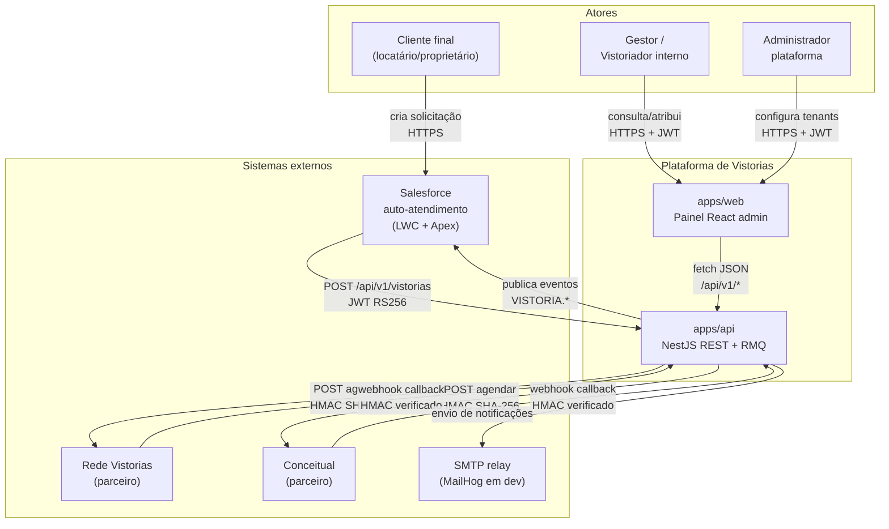

# C4 — Context

Visão de mais alto nível da Plataforma de Vistorias: o sistema, seus usuários e os sistemas externos que ele integra.

## Diagrama

## Atores

| Ator                 | Como interage                                                          |
| -------------------- | ---------------------------------------------------------------------- |
| Cliente final        | Solicita vistoria pelo Salesforce (LWC). Não acessa o painel admin.    |
| Gestor / Vistoriador | Acessa `apps/web` com JWT do tenant; consulta, atribui, valida laudos. |
| Administrador        | Acessa `apps/web`; gerencia tenants, usuários, parceiros.              |

## Sistemas externos

| Sistema                 | Direção      | Protocolo                                                                                   |
| ----------------------- | ------------ | ------------------------------------------------------------------------------------------- |
| Salesforce (LWC + Apex) | Bidirecional | REST JSON com JWT RS256 entrando, eventos de SAGA saindo                                    |
| Rede Vistorias          | Bidirecional | REST com HMAC SHA-256 nos webhooks ([ADR-007](../decisions/ADR-007-webhook-hmac-sha256.md)) |
| Conceitual              | Bidirecional | REST com HMAC SHA-256 nos webhooks ([ADR-007](../decisions/ADR-007-webhook-hmac-sha256.md)) |
| SMTP relay              | Saída        | SMTP — MailHog em dev (porta 1025)                                                          |

## Convenções

- Toda chamada externa carrega `X-Correlation-Id` para rastreabilidade ponta-a-ponta.
- Autenticação inter-sistema usa JWT RS256 ([ADR-004](../decisions/ADR-004-jwt-rs256.md)).
- Webhooks recebidos são autenticados por HMAC; o handler em `packages/integrations` rejeita antes de tocar no domínio.

## Diagramas relacionados

- [c4-container.md](./c4-container.md) — detalha como os containers internos se conectam.
- [event-flow.md](./event-flow.md) — exchanges/queues RabbitMQ.
- [saga-vistoria.md](./saga-vistoria.md) — máquina de estados da Vistoria.
