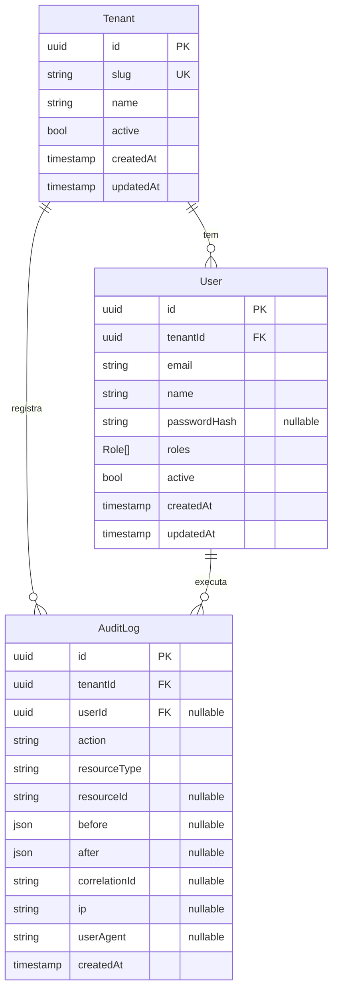

# ERD — Esquema Multi-tenant + Auditoria

Estado atual do `apps/api/prisma/schema.prisma` após a migration inicial `20260519001119_init`. Cobre apenas o esqueleto multi-tenant e auditoria — as entidades de domínio (`Vistoria`, `Imovel`, `Comodo`, etc.) entram em sprints futuras de BE, sempre com `tenantId` e seguindo o padrão de tenant isolation definido no `CLAUDE.md`.

## Diagrama

## Enum `Role`

| Valor         | Quem                                                                       |
| ------------- | -------------------------------------------------------------------------- |
| `ADMIN`       | Administra a plataforma (cross-tenant em casos excepcionais).              |
| `GESTOR`      | Gerencia vistorias dentro do tenant.                                       |
| `VISTORIADOR` | Executa vistorias atribuídas.                                              |
| `CLIENTE`     | Locatário/proprietário (acesso muito restrito).                            |
| `PARCEIRO`    | Conta técnica usada por integrações externas (Rede Vistorias, Conceitual). |

## Convenções obrigatórias

- **Tenant isolation**: toda nova tabela do domínio precisa de `tenantId UUID`, índice por `tenantId` e (quando aplicável) `@@unique([tenantId, ...])`. Não há shared rows entre tenants.
- **Audit log**: toda operação destrutiva ou sensível registra um `AuditLog` com `before/after`, `correlationId` propagado do request, `ip` e `userAgent`.
- **`onDelete`**:
  - `User → Tenant`: `Cascade` (remover tenant remove seus usuários).
  - `AuditLog → Tenant`: `Cascade`.
  - `AuditLog → User`: `SetNull` (preservar o registro mesmo se o usuário for removido).
- **PK UUID v4** em todas as tabelas (`@id @default(uuid()) @db.Uuid`).
- **Timestamps**: `createdAt @default(now())`, `updatedAt @updatedAt`.

## Tabelas físicas

| Model Prisma | Tabela       | Índices                                                                          |
| ------------ | ------------ | -------------------------------------------------------------------------------- |
| `Tenant`     | `tenants`    | PK `id`, UK `slug`                                                               |
| `User`       | `users`      | PK `id`, UK `(tenantId, email)`, IDX `tenantId`                                  |
| `AuditLog`   | `audit_logs` | PK `id`, IDX `(tenantId, createdAt)`, IDX `(tenantId, resourceType, resourceId)` |

## Próximas entidades planejadas (BE Sprint 06+)

- `Vistoria` (cabeçalho da SAGA com 9 estados — ver [saga-vistoria.md](./saga-vistoria.md))
- `VistoriaTransicao` (histórico de mudanças de estado)
- `Imovel` + `Comodo` (escopo físico)
- `LaudoItem` (fotos + observações)
- `ProviderRouting` (regra que decide qual parceiro recebe a vistoria)

Cada uma virá com migration própria e ADR caso introduza decisão não-trivial.
