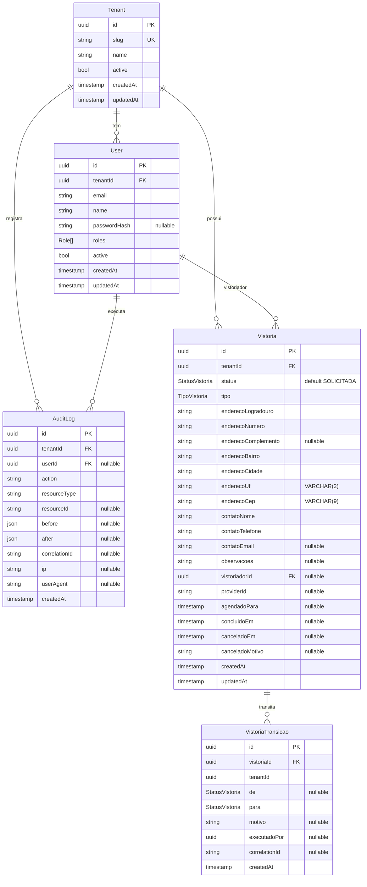

# ERD — Esquema Multi-tenant + Auditoria + Vistoria

Estado atual do `apps/api/prisma/schema.prisma` após as migrations:

- `20260519001119_init` — esqueleto multi-tenant + auditoria (Tenant, User, AuditLog)
- `20260519014024_add_vistoria_entities` — entidades do domínio Vistoria (Vistoria, VistoriaTransicao) + enums `StatusVistoria` e `TipoVistoria`

## Diagrama

## Enums

### `StatusVistoria`

Os 9 estados da SAGA (ver [saga-vistoria.md](./saga-vistoria.md)):
`SOLICITADA → ROTEADA → AGENDADA → CONFIRMADA → EM_EXECUCAO → LAUDO_PENDENTE → LAUDO_APROVADO → CONCLUIDA | CANCELADA`.

### `TipoVistoria`

`ENTRADA` (vistoria inicial) | `SAIDA` (vistoria final).

## Enum `Role`

| Valor         | Quem                                                                       |
| ------------- | -------------------------------------------------------------------------- |
| `ADMIN`       | Administra a plataforma (cross-tenant em casos excepcionais).              |
| `GESTOR`      | Gerencia vistorias dentro do tenant.                                       |
| `VISTORIADOR` | Executa vistorias atribuídas.                                              |
| `CLIENTE`     | Locatário/proprietário (acesso muito restrito).                            |
| `PARCEIRO`    | Conta técnica usada por integrações externas (Rede Vistorias, Conceitual). |

## Convenções obrigatórias

- **Tenant isolation**: toda nova tabela do domínio precisa de `tenantId UUID`, índice por `tenantId` e (quando aplicável) `@@unique([tenantId, ...])`. Não há shared rows entre tenants.
- **Audit log**: toda operação destrutiva ou sensível registra um `AuditLog` com `before/after`, `correlationId` propagado do request, `ip` e `userAgent`.
- **`onDelete`**:
  - `User → Tenant`: `Cascade` (remover tenant remove seus usuários).
  - `AuditLog → Tenant`: `Cascade`.
  - `AuditLog → User`: `SetNull` (preservar o registro mesmo se o usuário for removido).
- **PK UUID v4** em todas as tabelas (`@id @default(uuid()) @db.Uuid`).
- **Timestamps**: `createdAt @default(now())`, `updatedAt @updatedAt`.

## Tabelas físicas

| Model Prisma        | Tabela                | Índices                                                                                         |
| ------------------- | --------------------- | ----------------------------------------------------------------------------------------------- |
| `Tenant`            | `tenants`             | PK `id`, UK `slug`                                                                              |
| `User`              | `users`               | PK `id`, UK `(tenantId, email)`, IDX `tenantId`                                                 |
| `AuditLog`          | `audit_logs`          | PK `id`, IDX `(tenantId, createdAt)`, IDX `(tenantId, resourceType, resourceId)`                |
| `Vistoria`          | `vistorias`           | PK `id`, IDX `(tenantId, status)`, IDX `(tenantId, createdAt)`, IDX `(tenantId, vistoriadorId)` |
| `VistoriaTransicao` | `vistoria_transicoes` | PK `id`, IDX `vistoriaId`, IDX `(tenantId, createdAt)`                                          |

## Próximas entidades planejadas (BE Sprint 09+)

- `Imovel` + `Comodo` (escopo físico — atualmente endereço fica direto na Vistoria)
- `LaudoItem` (fotos + observações de um cômodo após execução)
- `ProviderRouting` (regra que decide qual parceiro recebe a vistoria, hoje `Vistoria.providerId` é string livre)

Cada uma virá com migration própria e ADR caso introduza decisão não-trivial.
