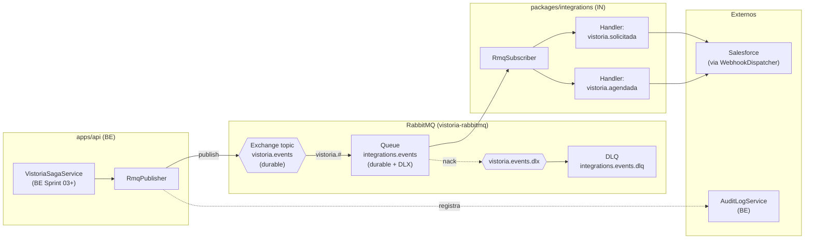
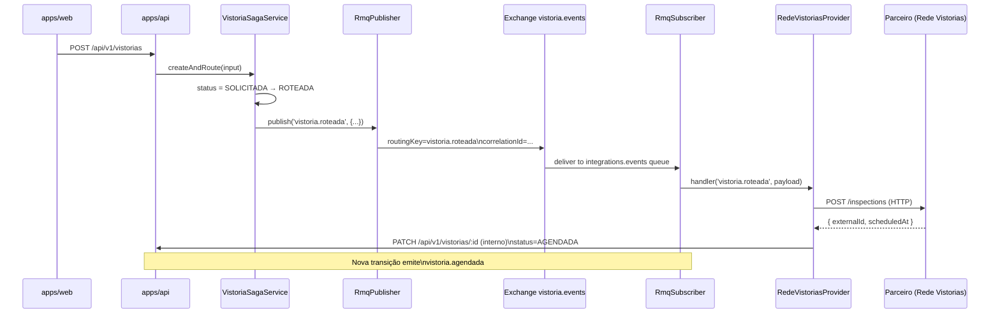

# Fluxo de Eventos — RabbitMQ

Como eventos da SAGA fluem através do exchange `vistoria.events`.

## Topologia

## Sequência típica: solicitação de vistoria

## Routing keys publicadas

Cada transição da SAGA gera um evento com `routingKey = "vistoria.<status_destino>"`:

| Status         | Routing key               |
| -------------- | ------------------------- |
| SOLICITADA     | `vistoria.solicitada`     |
| ROTEADA        | `vistoria.roteada`        |
| AGENDADA       | `vistoria.agendada`       |
| CONFIRMADA     | `vistoria.confirmada`     |
| EM_EXECUCAO    | `vistoria.em_execucao`    |
| LAUDO_PENDENTE | `vistoria.laudo_pendente` |
| LAUDO_APROVADO | `vistoria.laudo_aprovado` |
| CONCLUIDA      | `vistoria.concluida`      |
| CANCELADA      | `vistoria.cancelada`      |

A queue `integrations.events` faz bind com pattern `vistoria.#` (todas). Subscribers individuais filtram pela routing key dentro do `RmqSubscriber.subscribe(routingKey, handler)`.

## Garantias

- **Durabilidade**: exchange e queue declarados `durable=true`; mensagens com `persistent=true`
- **At-least-once**: handler que falhar gera nack sem requeue → DLX. Handler **deve ser idempotente** (e.g., usar `correlationId` ou hash do payload para deduplicação em Redis)
- **Ordem**: RabbitMQ não garante ordem global em topic exchanges. Para eventos sequenciais por vistoria, a SAGA do BE garante que o status atual no DB é a verdade — handlers consomem o evento, leem estado atual e reagem

## Pendências

- DLX (`vistoria.events.dlx`) e DLQ (`integrations.events.dlq`) ainda não declaradas explicitamente — apenas `deadLetterExchange` no `assertQueue`. **QI Sprint próximo**: declaração explícita + alarme em mensagens não-consumidas
- Métricas Prometheus de publish/consume — ver TODO em [ADR-006](../decisions/ADR-006-amqplib-vs-nestjs-microservices.md)
