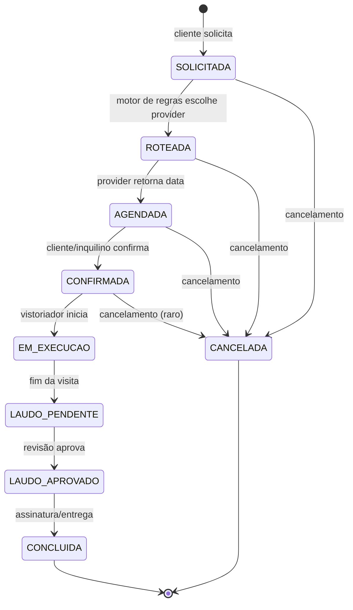

# SAGA de Vistoria — Máquina de Estados

Os 9 estados do ciclo de vida de uma Vistoria, definidos em [`CLAUDE.md`](../../CLAUDE.md) (princípio arquitetural #5) e formalizados em [`@vistoria/api-contracts`](../../packages/api-contracts/src/vistoria/status.ts) via `StatusVistoriaSchema`.

> **Status do código**: o enum existe e é exportado. As **transições** ainda não estão implementadas (BE Sprint 03+ entrega o motor `VistoriaSagaService`).

## Diagrama

## Tabela de transições

| De                                             | Para             | Gatilho                          | Quem dispara                               |
| ---------------------------------------------- | ---------------- | -------------------------------- | ------------------------------------------ |
| —                                              | `SOLICITADA`     | criação                          | cliente (Salesforce ou web)                |
| `SOLICITADA`                                   | `ROTEADA`        | motor de regras escolhe provider | BE (sistema)                               |
| `ROTEADA`                                      | `AGENDADA`       | provider retorna data            | adapter IN (webhook ou poll)               |
| `AGENDADA`                                     | `CONFIRMADA`     | inquilino confirma               | webhook do parceiro ou ação interna        |
| `CONFIRMADA`                                   | `EM_EXECUCAO`    | vistoriador inicia visita        | webhook ou app vistoriador                 |
| `EM_EXECUCAO`                                  | `LAUDO_PENDENTE` | fim da visita                    | webhook ou app vistoriador                 |
| `LAUDO_PENDENTE`                               | `LAUDO_APROVADO` | revisão interna aprova           | gestor (web)                               |
| `LAUDO_APROVADO`                               | `CONCLUIDA`      | entrega final                    | sistema (auto após N dias?) ou ação manual |
| `SOLICITADA / ROTEADA / AGENDADA / CONFIRMADA` | `CANCELADA`      | cancelamento                     | cliente, gestor ou parceiro                |

`STATUS_CANCELAVEIS` em [`packages/api-contracts/src/vistoria/status.ts`](../../packages/api-contracts/src/vistoria/status.ts) lista exatamente os 4 estados que admitem `CANCELADA`. Após `EM_EXECUCAO`, cancelamento é raro e exige justificativa explícita (a SAGA a ser implementada deve registrar isso como exceção, não como transição padrão).

## Invariantes

1. **Estados terminais** (`CONCLUIDA`, `CANCELADA`) não admitem mais transições
2. **Cada transição é atômica** e gera um evento RMQ no exchange `vistoria.events` com routingKey `vistoria.<status_destino>` (ex.: `vistoria.agendada`)
3. **Cada transição grava `AuditLog`** com `before` (status anterior), `after` (novo status), `correlationId`, `userId`
4. **Tenant isolation**: toda transição roda dentro do escopo do tenant da vistoria

## Próximos passos

- BE Sprint 03+ implementa `VistoriaSagaService` com método `transition(vistoriaId, novoStatus, contexto)` validando transições legais
- IN Sprint 04+ pluga adapters reais que disparam transições via webhooks/poll
- DOC manterá este diagrama em sincronia se a SAGA mudar (ADR + bump de versão de `@vistoria/api-contracts`)
