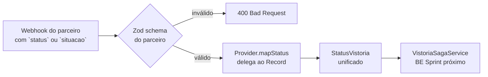

# Status Mapping — Parceiros → SAGA

Cada parceiro usa seu próprio vocabulário de status. O backend converte para o enum unificado `StatusVistoria` (9 estados) usando Records imutáveis em [`packages/api-contracts/src/webhooks/index.ts`](../../packages/api-contracts/src/webhooks/index.ts).

Decisão de design: [ADR-009](../decisions/ADR-009-status-mapping-record.md).

## Matriz

| `StatusVistoria` (SAGA) | Rede Vistorias                                          | Conceitual               |
| ----------------------- | ------------------------------------------------------- | ------------------------ |
| `SOLICITADA`            | `PENDING`                                               | `AGUARDANDO`             |
| `ROTEADA`               | — _(decisão interna do BE; parceiro não tem)_           | —                        |
| `AGENDADA`              | `SCHEDULED`                                             | `AGENDADA`               |
| `CONFIRMADA`            | `CONFIRMED`                                             | — _(ausente; BE decide)_ |
| `EM_EXECUCAO`           | `IN_PROGRESS`                                           | `EM_VISTORIA`            |
| `LAUDO_PENDENTE`        | `REPORT_PENDING`                                        | `AGUARDANDO_LAUDO`       |
| `LAUDO_APROVADO`        | — _(parceiro não distingue; vai direto para COMPLETED)_ | `LAUDO_OK`               |
| `CONCLUIDA`             | `COMPLETED`                                             | `FINALIZADA`             |
| `CANCELADA`             | `CANCELED`                                              | `CANCELADA`              |

## Fluxo do mapping



## Garantia de exaustividade

Os Records são tipados como `Readonly<Record<PartnerStatus, StatusVistoria>>`. Se o **enum do parceiro** ganhar um valor novo (ex.: `EXPIRED` em Rede Vistorias), o TypeScript falha em compilação até o mapping ser atualizado. Isso protege contra silêncio.

```typescript
// packages/api-contracts/src/webhooks/index.ts
export const REDE_VISTORIAS_TO_STATUS: Readonly<
  Record<RedeVistoriasStatus, StatusVistoria>
> = {
  PENDING: "SOLICITADA",
  SCHEDULED: "AGENDADA",
  CONFIRMED: "CONFIRMADA",
  IN_PROGRESS: "EM_EXECUCAO",
  REPORT_PENDING: "LAUDO_PENDENTE",
  COMPLETED: "CONCLUIDA",
  CANCELED: "CANCELADA",
};
```

## Estados sem correspondência direta

Os "—" da tabela representam estados nossos sem equivalente direto no parceiro:

- **`ROTEADA`** é decisão interna; nasce no BE quando o motor de regras escolhe um provider
- **`CONFIRMADA`** existe na Rede Vistorias mas não na Conceitual — para Conceitual, BE deduz a confirmação por contexto (data passada + status `AGENDADA`)
- **`LAUDO_APROVADO`** existe na Conceitual; Rede Vistorias pula direto de `REPORT_PENDING` para `COMPLETED`. Se quisermos forçar passagem por `LAUDO_APROVADO` para vistorias da Rede, BE introduz revisão manual antes do `CONCLUIDA`

## Reverso (debug / auditoria)

Para uma operação reversa (dado um `StatusVistoria`, listar valores compatíveis nos parceiros), basta `Object.entries`:

```typescript
function statusVistoriaToPartner(target: StatusVistoria): {
  redeVistorias: RedeVistoriasStatus[];
  conceitual: ConceitualStatus[];
} {
  return {
    redeVistorias: Object.entries(REDE_VISTORIAS_TO_STATUS)
      .filter(([_, v]) => v === target)
      .map(([k]) => k as RedeVistoriasStatus),
    conceitual: Object.entries(CONCEITUAL_TO_STATUS)
      .filter(([_, v]) => v === target)
      .map(([k]) => k as ConceitualStatus),
  };
}
```

## Pendências

- Adicionar mapping para o `InternoProvider` se ele ganhar status próprios distintos da SAGA
- Caso novos parceiros entrem, criar `<PARTNER>_TO_STATUS` seguindo o padrão e expor um `mapStatus()` estático no provider correspondente
