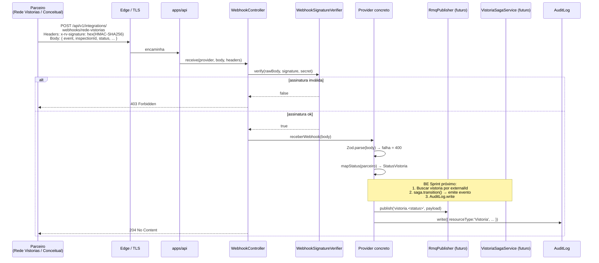
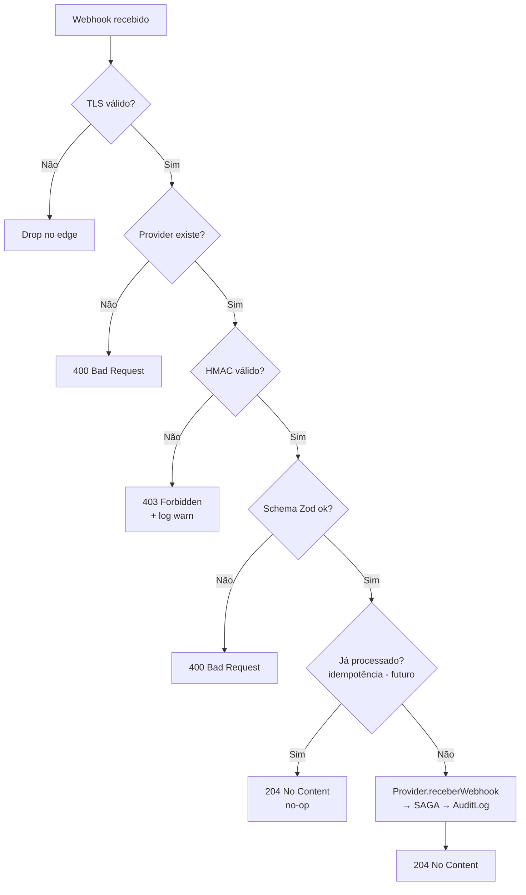

# Webhook Flow — Recebimento e Verificação

Como webhooks de parceiros são recebidos, autenticados e roteados. Decisões em [ADR-007](../decisions/ADR-007-webhook-hmac-sha256.md) e [ADR-009](../decisions/ADR-009-status-mapping-record.md).

## Sequência completa



## Defesas em camadas



## Configuração por parceiro

| Parceiro       | Header de assinatura     | Env var de secret               | Path                                                |
| -------------- | ------------------------ | ------------------------------- | --------------------------------------------------- |
| Rede Vistorias | `x-rv-signature`         | `REDE_VISTORIAS_WEBHOOK_SECRET` | `POST /api/v1/integrations/webhooks/rede-vistorias` |
| Conceitual     | `x-conceitual-signature` | `CONCEITUAL_WEBHOOK_SECRET`     | `POST /api/v1/integrations/webhooks/conceitual`     |

Em dev, secrets vazios — verificação retorna `false` → 403. Para testar localmente:

```bash
SECRET="dev-secret-rv"
SIG=$(printf '%s' "$BODY" | openssl dgst -sha256 -hmac "$SECRET" -hex | awk '{print $2}')
curl -X POST http://localhost:3000/api/v1/integrations/webhooks/rede-vistorias \
  -H "Content-Type: application/json" -H "x-rv-signature: $SIG" \
  -d "$BODY"
```

## Pendências críticas

1. **Raw body capture**: o NestJS faz `JSON.parse` antes do controller, então o HMAC é computado contra `JSON.stringify(body)` (fallback) que pode diferir do body original em whitespace/ordem. Solução documentada em [ADR-007](../decisions/ADR-007-webhook-hmac-sha256.md):

   ```ts
   // apps/api/src/main.ts
   app.use(
     json({
       verify: (req, _res, buf) => {
         (req as any).rawBody = buf;
       },
     }),
   );
   ```

2. **Idempotência**: replay attacks ainda viáveis. Sprint próximo deve cachear `inspectionId + occurredAt` em Redis com TTL de 24h.

3. **Timestamp validation**: rejeitar webhooks com `occurredAt > 5min no passado` para mitigar replay com signature válida.

4. **Audit log de webhooks recebidos**: ainda não escrito. FE Sprint 04 deixou pendente uma tela "Webhooks recebidos" que dependerá disso.
